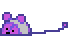

    <h3>Hello There! 👋</h3>
    <h2>I'm tiny_mauss</h2>
    

        
    

    

        ||<a href="https://github.com/eust-w/eust-w/blob/main/README-UA.md">Українська</a>||
    

    <h3 align=center>👾 I do cool or not stuff 👾</h3>
    <h2>About me</h2>
    

I'm a young programmer from Ukraine:) 
I don't come here often, but I do interesting things.
	

Some unnecessary info

Memories: 
	[ERROR: Encrypted data\>] 
These memories warm my heart like nothing else 
 
Fears: 
Thalassophobia. 
 

Hopes: 
To survive.

   
  
<h2>My repos: </h2>

   <table align="center">
        <tr>
            <td><a href="https://github.com/inhat-d/OneOne">OneOne-AI</a> - Speek to OneOne, from Infinite Train series</td>
            <td><a href="https://github.com/inhat-d/RaspMessage">RaspMessage</a> - (Was a private) website to cheet on lessons</td>
        </tr>
        <tr>
            <td><a href="https://github.com/inhat-d/animation">animation</a> - Just a simple screen saver animation, nothing bigger</td>
            <td><a href="https://github.com/inhat-d/MyNameIs-ARDUINO">My Name Is</a> - Arduino program, to display lyrics from Eminem's song</td>
        </tr>
    </table>

